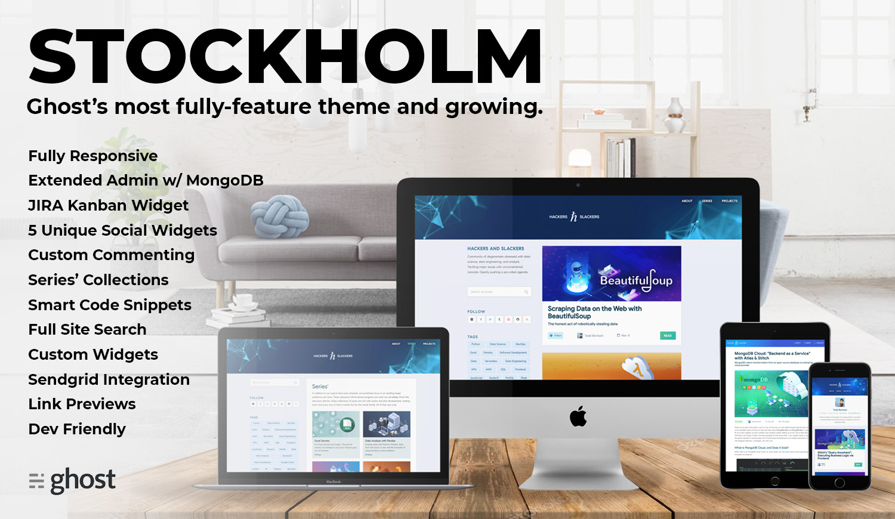

# Stockholm Ghost Theme


[](https://github.com/toddbirchard/ghosttheme-stockholm/issues)
[](https://github.com/toddbirchard/ghosttheme-stockholm/stargazers)
[](https://github.com/toddbirchard/ghosttheme-stockholm/network)

Stockholm is a (currently) free theme for the [Ghost](https://github.com/TryGhost) blogging platform. This theme can be  previewed via our live site, which runs off this theme: [https://hackersandslackers.com/](https://hackersandslackers.com/)



# About

_Stockholm_ is arguably the most feature-rich Ghost theme on the market. With some light  configuration, users can extend their app's functionality by accessing data which would be otherwise inaccessible via Ghost, thus introducing a plethora of features and widgets.  Users can personalize their themes via simple config files, enabling contextual widgets, fully integrated user sign ups, and unique page templates.

This project is in *active development*. All are welcome to use this theme, but oddities _will_ exist until more user-friendly configuration is completed. For example, certain services are specifically whitelisted to the working domain and will break when cloned. This is being fixed.

## Features

Beyond predictable built-in blog features, *Stockholm* leverages services atypical blog themes to provide delightfully refreshing yet technically complex functionality.

### Major Features

- User Authentication & Signup for Readers
- Homegrown commenting system: zero dependencies on Disquis or similar third parties
- Multi-post content series' for topics deserving more than a single post
- Full JIRA integration with functioning Kanban
- 'Contributors' page detailing bios for blog authors
- MongoDB Cloud integration to extend the capabilities of Ghost CMS
- Automatic link preview embeds via custom API
- "Smart" widgets which change based on their context
- Individual author pages with high personalization
- Global search
- Automatic image compression via Gulp
- Featured posts
- Responsive layout

### Widgets

- Github project modules
- Github user activity
- Blog Contributors
- Recent posts
- Related posts
- Series
- Twitter Feed with custom styles
- Meetup Events by author
- Medium posts by author

### Features In Development

- Cheatsheet section: collection of common code snippet patterns
- Custom commenting system
- Sendgrid email signups
- Additional 'Series' widgets

### Planned Features

- Recommended posts
- Recommended services & tools
- Guest posts
- Embedded executable code interpreters
- Author/tag subscriptions

## Installation

For information on installing the Ghost platform, please reference the [Ghost CLI](https://docs.ghost.org/docs/cli-install).

### Theme Quickstart

```
$ git clone https://github.com/toddbirchard/ghosttheme-stockholm.git
$ cd ghosttheme-stockholm
$ npm install
$ npm install gulp-cli -g
$ npm install gulp -D
$ gulp
```
As always, remeber to restart your ghost instance when introducing new themes or templates.

### Developers

Ghost uses [Handlebars](http://handlebarsjs.com/) for templating. This theme is styled using [LESS](http://lesscss.org/).

**Custom Templates:**

- `custom-author-archive.hbs`: Alternative "about" page which displays author bios.
- `custom-projects.hbs`: Lists chosen Github Repos & a live JIRA kanban board integration
- `custom-tag-archive.hbs`: Template for ongoing editorial series'
- `custom-signup-confirm`: Confirmation page for new user account creation

### Maintenance

- Documentation
- User-friendly configuration
- Speed optimization
